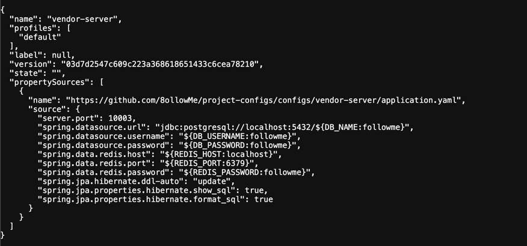

# 🗂️ Project Configurations

이 저장소는 8ollowMe 마이크로서비스 아키텍처에서 사용하는 모든 서비스의 중앙 설정(Spring Cloud Config)을 관리합니다.

## 📂 저장소 구조

설정 파일은 서비스명과 환경(Profile)별로 구조화되어 있습니다.

```text
configs/
├── common/
│   └── application.yaml       # 모든 서비스 공통 설정 (DB 공통 옵션, 유레카 주소 등)
├── {service-name}/
│   ├── application.yaml       # 특정 서비스의 전용 공통 설정
│   └── {profile}/
│       └── application.yaml   # 특정 서비스의 환경별 설정 (local, dev, prod)
```

---

## 설정 적용 규칙

### 1. 프로필 자동 매칭

각 서비스는 실행 시 지정된 `spring.profiles.active` 값에 따라 자동으로 해당 경로의 설정을 불러옵니다.

- 예시: `vendor-server`를 `local` 프로필로 실행 시

    - `configs/common/application.yaml` 로드 (1순위 공통 설정)
    - `configs/vendor/local/application.yaml` 로드 (2순위)
    - `configs/vendor/application.yaml` 로드 (3순위)
    - 겹치는 설정이있다면 우선순위가 높은 설정으로 적용

---

## 설정 수정 및 반영 절차

### 1. 설정 수정

1. 본 저장소를 `git clone` 하거나 GitHub 웹 UI에서 직접 수정합니다.

2. 수정 후 `dev` 브랜치에 **Push** 합니다.

### 2. 실시간 반영 (Config Refresh)

서버 재시작 없이 변경 사항을 반영하려면 해당 서비스에 Refresh 요청을 보내야 합니다.

- **Method**: `POST`
- **URL**: `http://{service-host}:{port}/actuator/refresh`
- **대상**: 설정을 적용할 개별 마이크로서비스 (예: 10003 포트의 vendor-server)

---

## 디버깅 (정상 반영 확인)

Config Server(13100 포트)를 통해 현재 저장소의 설정이 어떻게 JSON으로 서빙되는지 직접 확인할 수 있습니다.

- URL 형식: `http://localhost:13100/{application}/{profile}`
- 확인 예시: `http://localhost:13100/vendor/default`




---

## ⚠️ 주의 사항

1. **민감 정보 금지**: DB 비밀번호, API 키 등 보안이 필요한 정보는 절대로 평문으로 올리지 마세요.

2. **폴더명 주의**: `spring.application.name`과 `configs/` 하위의 폴더명이 정확히 일치해야 설정 누락이 발생하지 않습니다.

3. **공통 설정 주의**: `configs/common/` 수정 시 모든 마이크로서비스에 영향을 주므로 신중하게 변경해야 합니다.